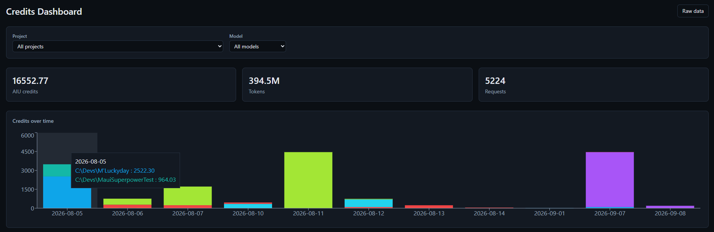
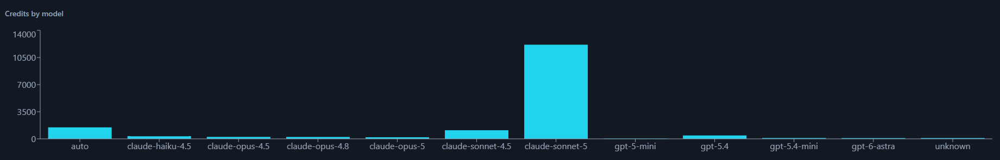
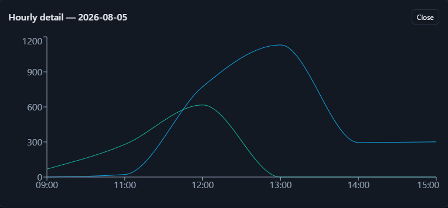
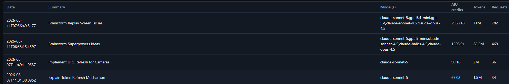

# Credits Dashboard

A local desktop app that shows your GitHub Copilot CLI credit (AIU) and token
consumption, filterable by project, model, and date range.

🔒 **Privacy-first**: everything runs on your machine. It reads
`~/.copilot/session-store.db` read-only — no network calls, no GitHub
permissions required, nothing ever leaves your computer.

## Download

Grab the latest Windows build from the
[Releases page](https://github.com/jm-parent/CreditsTracker/releases/latest):
download and run `CreditsTracker-<version>-win32-x64-Setup.exe` — no Node.js
required.

## Features

A sidebar lets you switch between six tabs, each scoped to the current
project/model/date filters:

- **Daily consumption** — total AIU credits, tokens, and requests at a
  glance, with a stacked bar chart of credits over time broken down by
  project (hover a bar to see the per-project breakdown for that day).
  Click a day to open an hourly breakdown showing usage trends throughout
  that day.
- **By project** — per-project totals with a breakdown chart and table;
  click a project's bar to drill into a detail page for that project.
- **By model** — per-model totals with a breakdown chart and a table
  showing AIU credits and each model's "% of total" share of usage.
- **Raw data** — a sortable table of every session with date, summary,
  model(s) used, AIU credits, tokens, and request count, for drilling into
  the underlying data.
- **Logs** — the application's own diagnostic log (startup, database access,
  failed IPC calls, and any renderer crash with its stack trace), filterable
  by level and text. Logs are also written to
  `%APPDATA%\credits-tracker\logs\app.log` (rotated at 2 MB), and the page
  offers "Copy" and "Open log folder" so a broken screen can be reported with
  the underlying error attached.
- **Filtering** — filter all tabs' charts and stats by project and/or model.
- **Live updates** — the dashboard refreshes itself automatically every few
  seconds, so credits from a Copilot CLI (or Copilot Chat) session you just
  finished show up on screen shortly after, without restarting the app.
- **Copilot Chat included** — usage from the GitHub Copilot Chat extension in
  VS Code is merged in alongside Copilot CLI usage, so you get one unified
  view of your Copilot credit consumption.
- **Opt-in app updates** — the app checks GitHub Releases for a newer version
  on startup and every few hours. When one is found, a small download icon
  appears next to the version number in the sidebar; clicking it opens a
  dialog with the release notes. Nothing is ever downloaded or installed
  until you accept, and the new version is applied when you restart the app.

## Screenshots

<!-- TODO: screenshots below still show the pre-sidebar single-page layout; refresh after next UI pass -->

**Dashboard overview**

**Credits by model**

**Hourly detail**

**Raw data table**

## For developers

Building, testing, releasing, and a technical overview of how the app works
live in the [developer guide](docs/DEVELOPMENT.md).
